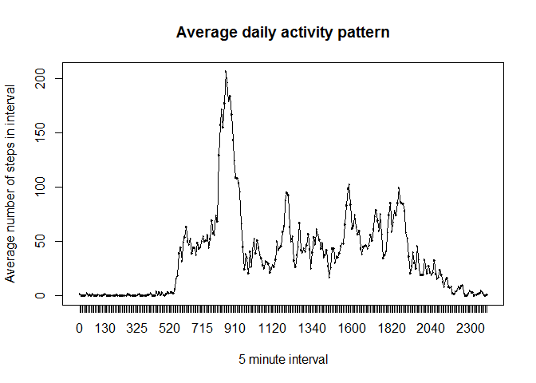
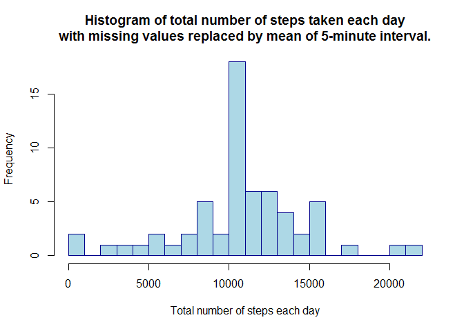
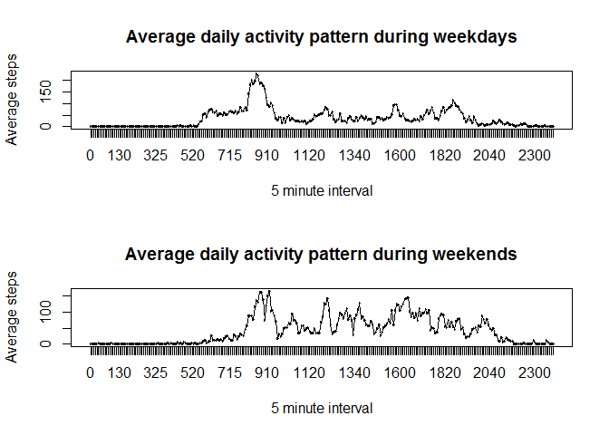

# Reproducible Research: Peer Assessment 1


## Loading and preprocessing the data


```r
unzip("activity.zip")
data<-read.csv("activity.csv")
```

## What is mean total number of steps taken per day?


```r
numberStepsPerDay<-aggregate(data$steps, list(data$date), sum)[,2]
hist(numberStepsPerDay, border = "dark blue", col="lightblue", breaks=20,
    main="Histogram of total number of steps taken each day.",
    xlab="Total number of steps each day")
```

 

```r
meanStepsPerDay<-mean(numberStepsPerDay, na.rm=TRUE)
medianStepsPerDay<-median(numberStepsPerDay, na.rm=TRUE)
```
The mean of the total number of steps per day is 10766.19.  
The median of the total number of steps per day is 10765.

## What is the average daily activity pattern?


```r
averageSteps<-aggregate(data$steps, list(factor(data$interval)), mean, na.rm=TRUE)
names(averageSteps)<-c("interval","mean")
plot.new()
frame()
plot(x=averageSteps$interval, y=averageSteps$mean, type="l", 
    main="Average daily activity pattern",
    xlab="5 minute interval",
    ylab="Average number of steps in interval")
lines(x=averageSteps$interval, y=averageSteps$mean)
```

 


```r
maxInterval<-averageSteps$interval[which(averageSteps$mean==max(averageSteps$mean))]
```
The 5-minute interval, which, on average across all the days in the dataset, contains the maximum number of steps is: 835.  

## Imputing missing values


```r
missing.amount<-sum(is.na(data))
```
The total number of missing values in the dataset is 2304.  

The strategy for filling in the missing values in the dataset is to use the mean for that 5-minute interval.

```r
data.filled<-data
data.filled$steps<-ifelse(is.na(data$steps),averageSteps$mean[match(data$interval,averageSteps$interval)],data$steps)
numberStepsPerDay.filled<-aggregate(data.filled$steps, list(data.filled$date), sum)[,2]
hist(numberStepsPerDay.filled, border = "dark blue", col="lightblue", breaks=20,
    main="Histogram of total number of steps taken each day\nwith missing values replaced by mean of 5-minute interval.",
    xlab="Total number of steps each day")
```

 

```r
meanStepsPerDay.filled<-mean(numberStepsPerDay.filled, na.rm=TRUE)
medianStepsPerDay.filled<-median(numberStepsPerDay.filled, na.rm=TRUE)
```
The mean of the total number of steps per day is 10766.19.  
The median of the total number of steps per day is 10766.19.  

The impact of imputing missing data on the estimates of the total numbers of steps is that there are much more of the values occuring around the average, as shown by the high peak, while the remaining frequencies are unchanged. The mean value is unchanged, while the median value is now identical to one of the filled in values.

## Are there differences in activity patterns between weekdays and weekends?

```r
library(dplyr, warn.conflicts=FALSE, verbose=FALSE, quietly=TRUE)
data.filled<-mutate(data.filled, 
    typeOfDay = factor(ifelse(weekdays(as.Date(date))=="Sunday"|weekdays(as.Date(date))=="Saturday","weekend","weekday")))
date.filled.weekday = filter(data.filled, typeOfDay=="weekday")
date.filled.weekend = filter(data.filled, typeOfDay=="weekend")
averageSteps.weekday<-aggregate(date.filled.weekday$steps, list(factor(date.filled.weekday$interval)), mean)
averageSteps.weekend<-aggregate(date.filled.weekend$steps, list(factor(date.filled.weekend$interval)), mean)
names(averageSteps.weekday)<-c("interval","mean")
names(averageSteps.weekend)<-c("interval","mean")
plot.new()
frame()
par(mfrow=c(2,1))
plot(x=averageSteps.weekday$interval, y=averageSteps.weekday$mean, type="l", 
    main="Average daily activity pattern during weekdays",
    xlab="5 minute interval",
    ylab="Average steps")
lines(x=averageSteps.weekday$interval, y=averageSteps.weekday$mean)
plot(x=averageSteps.weekend$interval, y=averageSteps.weekend$mean, type="l", 
    main="Average daily activity pattern during weekends",
    xlab="5 minute interval",
    ylab="Average steps")
lines(x=averageSteps.weekend$interval, y=averageSteps.weekend$mean)
```

 

One of the differences between weekdays and weekends is that significant activity starts and ends later in the weekends.
